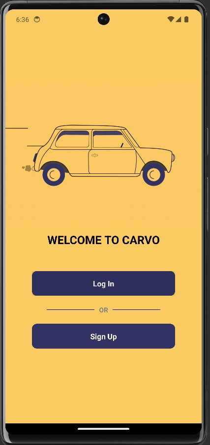
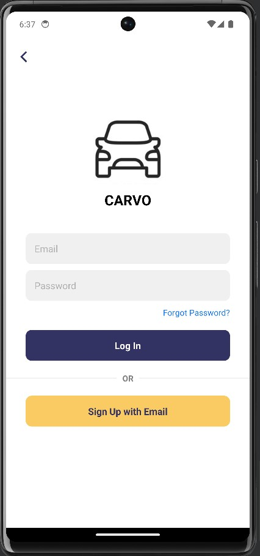
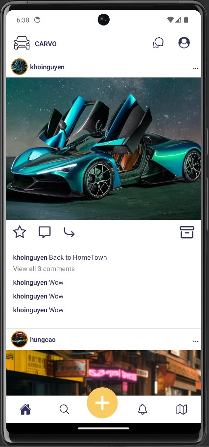
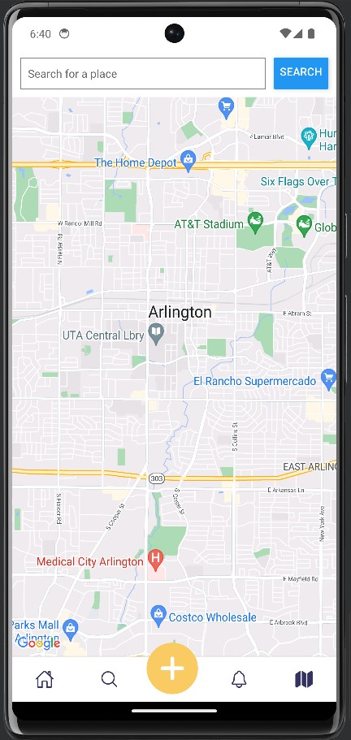
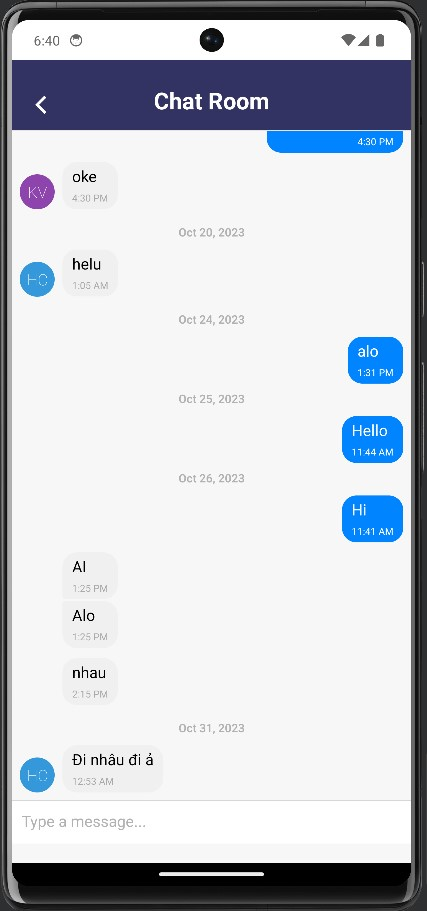

# CARVO Social Media Application Project 


## About the application
CARVO is a social media platform where users can share their feedback and thoughts about specific automobiles they have used. Our application provides a space for everyone to connect with their passion for the automotive world.

Our platform offers a unique space where users can not only share their automotive adventures but also dive deep into the world of cars, motorcycles, trucks, and help users discover the best nearby dealerships, making the car selection process more accessible and reliable.

## Technology
This project uses:

- React Native
- Redux
- Node.js
- Firebase
- Expo
- JavaScript
- Express.js
  

## Running the project

To run the project, please follow these steps:
1. Install Node.js on your computer using this link
   ```js
   https://nodejs.org/
   ```
3. Clone the github project on the terminal
   ```js
   git clone https://github.com/Nguyen2705/CarProject.git
   ```
5. Open the project in VSCode and replace the firebase config object with yours from firebase. (You can skip this step if you want to use our firebase server)
   ```js
   const firebaseConfig = {
     apiKey: 'xxx-xxx-xxx-xxx-xxx-xxx-xxx-xxx',
     authDomain: 'xxx-xxx-xxx-xxx-xxx-xxx-xxx',
     databaseURL: 'xxx-xxx-xxx-xxx-xxx-xxx-xxx-xxx-xxx',
     projectId: 'xxx-xxx-xxx',
     storageBucket: 'xxx-xxx-xxx-xxx-xxx',
     messagingSenderId: 'xxx-xxx-xxx',
     appId: 'xxx-xxx-xxx-xxx-xxx-xxx-xxx-xxx',
     measurementId: 'xxx-xxx-xxx',
   }
   ```
6. Open new terminal and run the following commands.
   ```sh
   cd CarProject
   npm install -g yarn  # In case you haven't install yarn
   yarn install
   yarn start
   
   # You will have the option to either run it on iOS, Android or Web
   
   # Press w to run the project on the web

   # If you want to run it on iOS or Android, use a phone to scan the QR code or use a simulator
   ```
7. Choose your platform and experience the app.


## Welcome Page



## Login Page



## Home Page



## Map Page



## Chat Room


